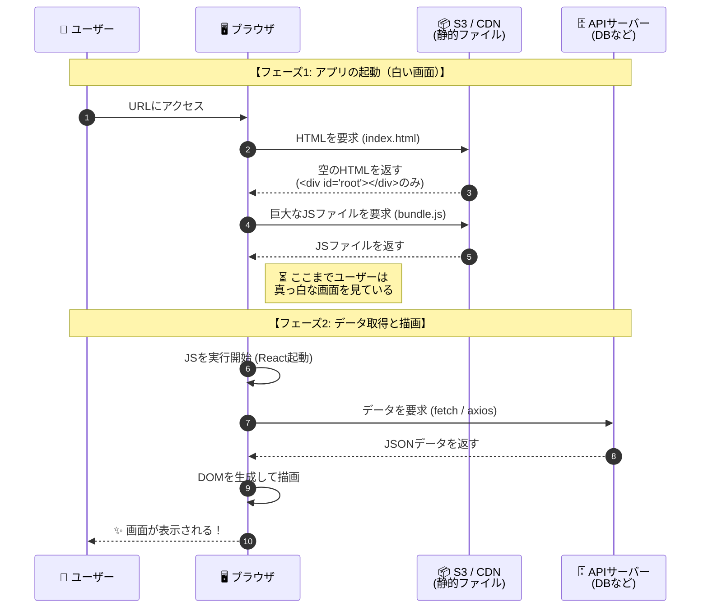
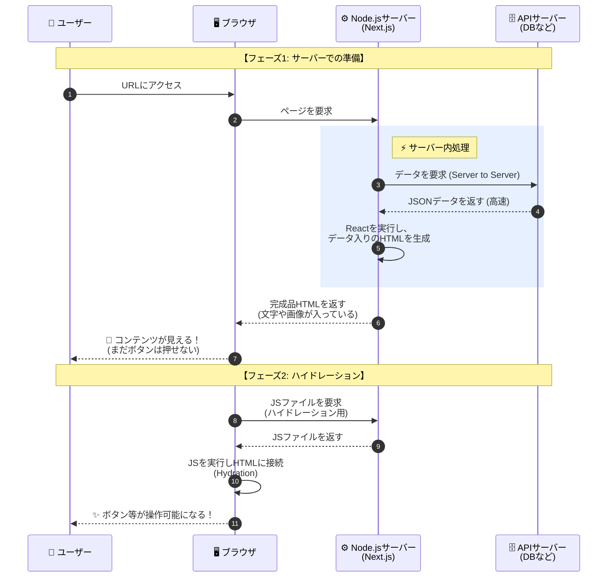

# CSRとSSRのフロー比較

## CSR (Client Side Rendering)

```mermaid
sequenceDiagram
    autonumber
    participant User as 👤 ユーザー
    participant Browser as 🖥️ ブラウザ
    participant S3 as 📦 S3 / CDN<br>(静的ファイル)
    participant API as 🗄️ APIサーバー<br>(DBなど)

    Note over User, API: 【フェーズ1: アプリの起動（白い画面）】
    User->>Browser: URLにアクセス
    Browser->>S3: HTMLを要求 (index.html)
    S3-->>Browser: 空のHTMLを返す<br>(<div id="root"></div>のみ)
    Browser->>S3: 巨大なJSファイルを要求 (bundle.js)
    S3-->>Browser: JSファイルを返す

    Note right of Browser: ⏳ ここまでユーザーは<br>真っ白な画面を見ている

    Note over User, API: 【フェーズ2: データ取得と描画】
    Browser->>Browser: JSを実行開始 (React起動)
    Browser->>API: データを要求 (fetch / axios)
    API-->>Browser: JSONデータを返す
    Browser->>Browser: DOMを生成して描画
    Browser-->>User: ✨ 画面が表示される！
```

## SSR (Server Side Rendering)

```mermaid
sequenceDiagram
    autonumber
    participant User as 👤 ユーザー
    participant Browser as 🖥️ ブラウザ
    participant Node as ⚙️ Node.jsサーバー<br>(Next.js)
    participant API as 🗄️ APIサーバー<br>(DBなど)

    Note over User, API: 【フェーズ1: サーバーでの準備】
    User->>Browser: URLにアクセス
    Browser->>Node: ページを要求

    rect rgb(230, 240, 255)
        Note right of Node: ⚡ サーバー内処理
        Node->>API: データを要求 (Server to Server)
        API-->>Node: JSONデータを返す (高速)
        Node->>Node: Reactを実行し、<br>データ入りのHTMLを生成
    end

    Node-->>Browser: 完成品HTMLを返す<br>(文字や画像が入っている)
    Browser-->>User: 👀 コンテンツが見える！<br>(まだボタンは押せない)

    Note over User, API: 【フェーズ2: ハイドレーション】
    Browser->>Node: JSファイルを要求<br>(ハイドレーション用)
    Node-->>Browser: JSファイルを返す
    Browser->>Browser: JSを実行しHTMLに接続<br>(Hydration)
    Browser-->>User: ✨ ボタン等が操作可能になる！
```