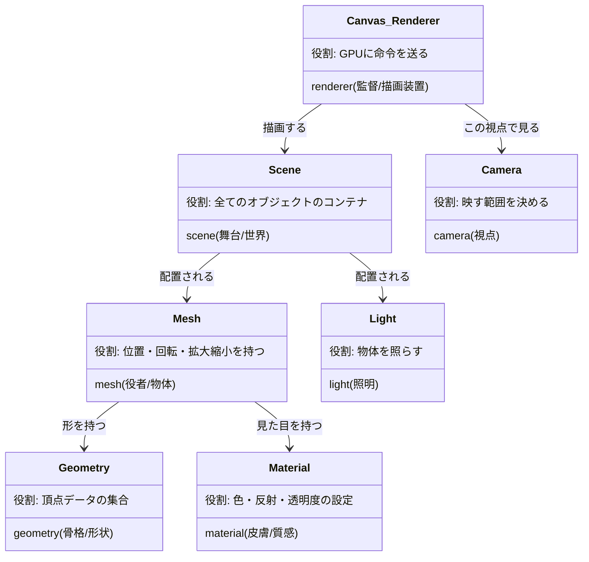

# WebGL / Three.js 基本用語図鑑

WebGLの世界は「映画の撮影セット」に例えると非常に理解しやすいです。
監督（Renderer）が、舞台（Scene）にある役者（Mesh）を、カメラ（Camera）を通してフィルム（Canvas）に映し出す、という構造になっています。

## 1. 全体像の相関図

まずは登場人物たちの関係性を整理しましょう。

## 2. 3大要素（舞台装置）

これらがないと、そもそも画面に何も映りません。

### 🎬 Renderer (レンダラー)
* **Three.js:** `THREE.WebGLRenderer`
* **R3F:** `<Canvas>` コンポーネントが内部で自動生成
* **解説:**
    映画監督兼カメラマンです。CPU（JavaScript）からの指示を受け取り、GPU（物理的なチップ）に「絵を描け」と命令を出す司令塔です。
    R3Fでは `<Canvas>` を書くだけで、このレンダラーのセットアップ、アニメーションループの管理、画面リサイズ対応などを全部自動でやってくれます。

### 🌍 Scene (シーン)
* **Three.js:** `THREE.Scene`
* **R3F:** `<Canvas>` の子要素として暗黙的に生成
* **解説:**
    「3D空間そのもの」です。座標 $(0,0,0)$ を中心とした無限に広がる空間。
    MeshやLightはすべてこのSceneに追加（add）されることで初めて存在できます。

### 📷 Camera (カメラ)
* **Three.js:** `THREE.PerspectiveCamera` など
* **R3F:** デフォルトで自動生成（または `makeDefault` で指定）
* **解説:**
    ユーザーの「目」です。3D空間のどこから、どの方向を見ているかを決めます。
    * **PerspectiveCamera (透視投影):** 遠くのものが小さく見える（人間の目に近い）。
    * **OrthographicCamera (平行投影):** 遠くのものも同じ大きさに見える（製図や2Dゲーム向け）。

## 3. オブジェクト構成要素（役者たち）

画面に映る「モノ」を構成する要素です。特に **Mesh, Geometry, Material** の3点セットは最重要です。

### 📦 Mesh (メッシュ)
* **R3F:** `<mesh>`
* **解説:**
    「物体」の単位です。
    **「形（Geometry）」と「見た目（Material）」を合体させ、さらに「位置（Position）・回転（Rotation）・大きさ（Scale）」**の情報を持たせたものです。
    * コード例: `<mesh position={[0, 0, 0]} rotation={[0, 1, 0]} ... />`
    * **重要:** `useFrame` で回転させる時、`ref` で掴むのは基本的にこの Mesh です。

### 🦴 Geometry (ジオメトリ)
* **R3F:** `<boxGeometry>`, `<sphereGeometry>`, `<bufferGeometry>`
* **解説:**
    物体の「形状」です。数学的には「頂点（Vertex）座標の集まり」です。
    * **プリミティブ:** 箱、球、平面など、最初から用意されている形。
    * **BufferGeometry:** 自分で頂点を1つずつ定義するカスタム形状（STEP 3の点群描画で使用）。
    * **特徴:** 色や質感の情報は持ちません。ただの「形」です。

### 🎨 Material (マテリアル)
* **R3F:** `<meshStandardMaterial>`, `<meshBasicMaterial>`, `<pointsMaterial>`
* **解説:**
    物体の「表面の質感」です。
    * **Basic:** 光の影響を受けない（影ができない）。ベタ塗り。
    * **Standard:** 物理ベースレンダリング（PBR）。光の影響を受け、リアルな金属感やプラスチック感を表現できる。
    * **Shader (GLSL):** 自分でプログラムを書くことで、炎、水、発光など自由自在な表現が可能（上級編）。

### 🖼 Texture (テクスチャ)
* **R3F:** `useLoader` で読み込み、Materialの `map` プロパティに渡す
* **解説:**
    マテリアルの表面に貼り付ける「画像」のことです。
    地球儀を作るなら、球体（Geometry）に、世界地図の画像（Texture）を貼り付けたマテリアル（Material）を着せるイメージです。

## 4. R3F と Three.js の対応表（Cheat Sheet）

React Three Fiber (R3F) は Three.js のクラス名を「キャメルケース（先頭小文字）」にするだけでタグとして使えます。

| 役割 | Three.js クラス名 (JS) | R3F タグ名 (JSX) | 備考 |
| :--- | :--- | :--- | :--- |
| **物体** | `new THREE.Mesh()` | `<mesh>` | 必須のラッパー |
| **点群** | `new THREE.Points()` | `<points>` | STEP 3で使用 |
| **形状(箱)** | `new THREE.BoxGeometry()` | `<boxGeometry>` | |
| **形状(球)** | `new THREE.SphereGeometry()` | `<sphereGeometry>` | |
| **材質(基本)** | `new THREE.MeshBasicMaterial()` | `<meshBasicMaterial>` | 光不要、軽い |
| **材質(標準)** | `new THREE.MeshStandardMaterial()` | `<meshStandardMaterial>` | リアル、光必須 |
| **環境光** | `new THREE.AmbientLight()` | `<ambientLight>` | 全体を明るくする |
| **平行光源** | `new THREE.DirectionalLight()` | `<directionalLight>` | 太陽のような光 |

## 5. コーチング：なぜ Geometry と Material は別々なの？

多くの初心者が疑問に思うポイントです。「全部まとめて1つの『箱クラス』にしてくれればいいのに」と思いませんか？

理由は **「メモリの節約（再利用）」** のためです。

もし「同じ形の赤い箱」を100個表示したい場合：
* **Geometry (形):** 1つだけメモリに作る。
* **Material (色):** 1つだけメモリに作る。
* **Mesh (配置):** 100個作るが、中身のGeometryとMaterialは**参照（リンク）**するだけ。

こうすることで、100個分の頂点データをメモリにコピーしなくて済むので、爆速で描画できるのです。これはGPUを効率的に使うための重要な設計思想です。